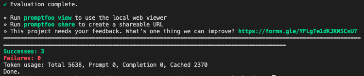

# Escrow 1024.17 Doc Chat Assistant

## RAG evaluation data
Final rag eval results: [RAG evaluation results](rag_eval_results.csv)  
I ran a experiments on Direct RAG along with advanced retrieval methods like Sentence Window and Auto-Merging Retrival. Furthermore, experiments included prameter variance as well to find the best configuration for Retrueving Escrow 1024.17 documents. The evaluations was run on [these queries](application/valid_eval_queries.txt). The results are as follows:


The best configuration (good balance of answer and context relevance, and groundedness) was found to be:
- Sentence retrieval window: 1 
- chunk size: 128
- effective retrieved context length (node): 384 characters

Notes: although not the cheapest configuration, it was the most effective in terms of Groundedness, answer relevance and context relevance.


## Prompt Template
the prompt template is created as follows (learnt from the [papers](#prompt-engineering-references) below):

\# Role  
(Role-play prompting is an effective stratigy where we assign a specific role to play during the interaction. This helps the model to "immerse" itself in the role and provide more accurate and relevant answers) [ref 1](#prompt-engineering-references)

\# Task  
(a direct description of what we want the model to do. One technique that works well is to use chain-of-thought prompting [ref 2](#prompt-engineering-references) to guide the model through the task)

\# Specifics
(provide most inportant notes regarding the task. Integrating Emotional Stimuli [ref 3](#prompt-engineering-references) has showin to increase response quality and accuracy)

\# Context   
()
\# Examples  
\# Notes  

### Prompt Engineering References

1. [Better Zero-Shot Reasoning with Role-Play Prompting](https://arxiv.org/abs/2308.07702)
2. [Chain-of-Thought Prompting Elicits Reasoning in Large Language Models](https://arxiv.org/abs/2201.11903)
3. [Large Language Models Understand and Can be Enhanced by Emotional Stimuli](https://arxiv.org/abs/2307.11760)
4. [Fairness-guided Few-shot Prompting for Large Language Models](https://arxiv.org/abs/2303.13217)
5. [Language Models are Few-Shot Learners](https://arxiv.org/abs/2005.14165)
6. [Rethinking the Role of Demonstrations: What Makes In-Context Learning Work?](https://arxiv.org/abs/2202.12837)
7. [Lost in the Middle: How Language Models Use Long Contexts](https://arxiv.org/abs/2307.03172)

## Prompt Evaluation
We are using [promptfoo](https://www.promptfoo.dev) for evaluating our prompts. To run the evaluation, first install promptfoo

```shell
bun add promptfoo
```
or 
```shell
npm install promptfoo
```

Then form the eval command from the root folder of this repo as follows:
```shell
$ cd prompt_eval_cloud
$ promptfoo eval
```
make sure the GROQ_API_KEY and OPENAI_API_KEY is set in the .env file.


To get the detailed view of the evalutaiton, run the following command: 
```shell
$ promptfoo view -y
```


run the following command:
```shell
$ promptfoo evaluate --prompt "prompt.txt" --model "model_name"
```


## How to interact with the Escrow 1024.17 Doc Chat Assistant

First install the dependencies
```shell
$ poetry install #first install the dependencies
$ poetry shell #activate the virtual environment
``` 

### Via Terminal

``` shell
$ python chat_assistant.py 
```


### Via Streamlit App
``` shell
$ streamlit run app.py 
```
